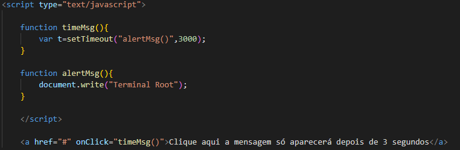

# Análise de código em javascript
 
## Descrição
 
A tarefa em escolher dois códigos em javascript, análisá-los e implementá-los para entender o que cada um faz.
 
### Código 1
•Este código HTML contém um script JavaScript embutido que define duas funções e um link que chama uma dessas funções quando clicado.

•A função timeMsg() é chamada quando o link é clicado. Ela define um temporizador que aguarda três segundos.

•A função alertMsg() é chamada após três segundos, como definido pela função timeMsg(). Ela escreve o texto "Terminal Root" no documento usando document.write().```

•O elemento &lt;a&gt; tem um evento onClick que dispara a função timeMsg() quando clicado. Isso faz com que a mensagem "Terminal Root" só apareça após três segundos de espera.```


### Código 2
• *type="text* " : Define o tipo de entrada como texto.
 
• *value="usuario"* : Define o valor inicial do campo como 'usuario'.
 
• *onblur* : Define uma ação a ser executada quando o campo perde o foco.
 
• *if(this.value == ' ') { this.value='usuario';}*
: Verifica se o campo esta vazio. Se tiver, define o valor como "usuario".
 
• *onfocus* : Define uma ação a ser executada quando o campo ganha foco.
 
• *if(this.value == 'usuario') {this.value= ' ' ;}*
: Verifica se o valor é "usuario" . Se for, limpa o campo.
 
• *value="senha"* : Define o valor inicial do campo como 'senha'
 
• *if(this.value == ' '){ this.value='senha' ; this.type='text';}*
: Verifica se o campo está vazio. Se estiver, Define o valor como 'senha' e o tipo como 'text'.
• *if(this.value == ' senha '){ this.value=' password' ;}* : Verifica se o valor é 'senha'. Se for, limpa o campo e define como 'password'

